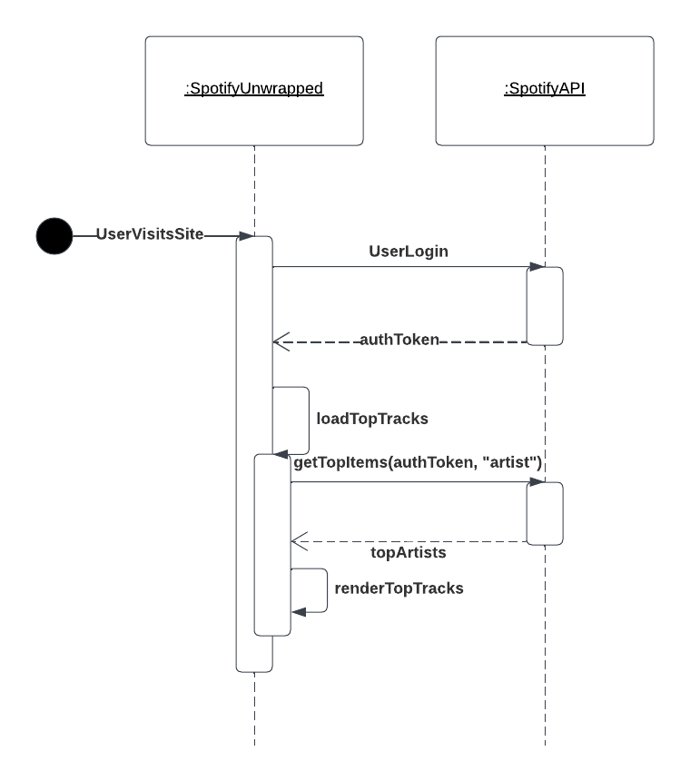

### Project Description
Spotify Unwrapped is a persistent version of Spotify's yearly wrapped review of a user's listening stats. Users will be able to login to our service and view their top tracks, top artists, and their listening profile. Users will see interesting and compelling statistics about their listening history, and share their profile with other people. 

### Document Description
This document describes the architecture of the Spotify Unwrapped project. It describes the project's model, framework, components, and view. It also describes the project's API and the endpoints which will be used by the frontend will call on our backend which interacts with the Spotify API. The document also describes the project's pages. The document also describes the project's framework and project layout.

### Pages
**Prototype**
- Top Artists
- Top Tracks
- User Profile
**Final Project**
- Home page: summary visualizations which could replace the user profile page

### Framework
- React (Frontend and API logic) - Vite (Build Tool)
- yarn (Package Manager)
- NodeJS WSC (Runtime)

### Project layout
```
├── README.md
├── index.js
├── package-lock.json
├── package.json
├── public
└── src
   ├── api
   ├── components
   ├── model
   ├── pages
   ├── index.css
   ├── index.js
   ├── reportWebVitals.js
   └── setupTests.js
```

### Model
- User
```JSON
{
  "country": "string",
  "display_name": "string",
  "email": "string",
  "explicit_content": {
    "filter_enabled": false,
    "filter_locked": false
  },
  "external_urls": {
    "spotify": "string"
  },
  "followers": {
    "href": "string",
    "total": 0
  },
  "href": "string",
  "id": "string",
  "images": [
    {
      "url": "https://i.scdn.co/image/ab67616d00001e02ff9ca10b55ce82ae553c8228",
      "height": 300,
      "width": 300
    }
  ],
  "product": "string",
  "type": "string",
  "uri": "string"
}
```
- AccessToken
```JSON
{
	"access_token": string,
	"token_type": string, 
	"scope": string,
	"expires_in": int,
	"refresh_token": string
}
```
- Item: A type which represents any listable object.
- Track
```JSON
{
      "album": {
        "album_type": "compilation",
        "total_tracks": 9,
        "available_markets": ["CA", "BR", "IT"],
        "external_urls": {
          "spotify": "string"
        },
        "href": "string",
        "id": "2up3OPMp9Tb4dAKM2erWXQ",
        "images": [
          {
            "url": "https://i.scdn.co/image/ab67616d00001e02ff9ca10b55ce82ae553c8228",
            "height": 300,
            "width": 300
          }
        ],
        "name": "string",
        "release_date": "1981-12",
        "release_date_precision": "year",
        "restrictions": {
          "reason": "market"
        },
        "type": "album",
        "uri": "spotify:album:2up3OPMp9Tb4dAKM2erWXQ",
        "artists": [
          {
            "external_urls": {
              "spotify": "string"
            },
            "href": "string",
            "id": "string",
            "name": "string",
            "type": "artist",
            "uri": "string"
          }
        ]
      },
      "artists": [
        {
          "external_urls": {
            "spotify": "string"
          },
          "followers": {
            "href": "string",
            "total": 0
          },
          "genres": ["Prog rock", "Grunge"],
          "href": "string",
          "id": "string",
          "images": [
            {
              "url": "https://i.scdn.co/image/ab67616d00001e02ff9ca10b55ce82ae553c8228",
              "height": 300,
              "width": 300
            }
          ],
          "name": "string",
          "popularity": 0,
          "type": "artist",
          "uri": "string"
        }
      ],
      "available_markets": ["string"],
      "disc_number": 0,
      "duration_ms": 0,
      "explicit": false,
      "external_ids": {
        "isrc": "string",
        "ean": "string",
        "upc": "string"
      },
      "external_urls": {
        "spotify": "string"
      },
      "href": "string",
      "id": "string",
      "is_playable": false,
      "linked_from": {
      },
      "restrictions": {
        "reason": "string"
      },
      "name": "string",
      "popularity": 0,
      "preview_url": "string",
      "track_number": 0,
      "type": "track",
      "uri": "string",
      "is_local": false
}
```
- Artist
```JSON
{
      "external_urls": {
        "spotify": "string"
      },
      "followers": {
        "href": "string",
        "total": 0
      },
      "genres": ["Prog rock", "Grunge"],
      "href": "string",
      "id": "string",
      "images": [
        {
          "url": "https://i.scdn.co/image/ab67616d00001e02ff9ca10b55ce82ae553c8228",
          "height": 300,
          "width": 300
        }
      ],
      "name": "string",
      "popularity": 0,
      "type": "artist",
      "uri": "string"
}
```
- ProfileItem
```JSON
{
   	"acousticness": 0.00242
}
```
- Profile
```JSON
[
	{"acousticness": 0.00242},
	{"danceability": 0.585},
	{"duration_ms": 237040},
	{"energy": 0.842},
	{"instrumentalness": 0.00686},
	{"key": 9},
	{"liveness": 0.0866},
	{"loudness": -5.883},
	{"mode": 0},
	{"speechiness": 0.0556},
	{"tempo": 118.211},
	{"time_signature": 4},
	{"valence": 0.428}
]
```
### Control
- Cache/Context: singleton data cache which stores the user data, access token, ect.

### Spotify Request Example


### Components/Pages
**Prototype**
- TopArtistsPage - Contains a list of the users top artists. Should call the `getTopArtists` method which is used to populate the `ListView` component.
- TopTracksPage - Contains a list of the users top artists. Should call the `getTopTracks` method which is used to populate the `ListView` component.
- UserListeningProfilePage - Contains a list of the users top artists. Should call the `getUserListeningProfile` method which is used to populate the `ListView` component.
- ListView - Takes a list of `Item` as a prop and returns a view of a list of items.
- ArtistTableItem - List item representing an artist. Contains name and popularity ranking.
- TrackTableItem - List item representing a track. Contains name, artist(s), and album name.
- ProfileTableItem - List item representing a listening profile table item.  Contains a description of the item and the value of the item.
**WIP**
- LandingPage - Introduces users to the application. Has a login button. The login button would initiate the auth flow by calling `initAuth()`.
- CallbackPage - Static page with verifies login and shows an error for login failure or redirects to TopArtistsPage if successful.
- TimeFilteredListView - Extension or `ListView` component with a switcher for time filter (short, medium, long)
- UserListeningProfileGraph - Basic listening profile graph which displays listening profile.
- UserListeningProfileDescription - A text box or boxes which describe different user profile values. Answers the question: 'What does valence mean?'
- ImageItem - A list item with an image.
- ArtistTableItem - Upgraded with image.
- TrackTableItem - Upgraded with image.
**Final Project**
- Navbar - Navigational bar for visiting different pages of the app.
- Share - Component for sharing a visualization.
- SettingsPage - Change visualization colors and themes.
- UserListeningProfileDescription - Upgraded with AI text generation.
- AdvancedVisualizations - More complicated visualizations of user listening data (trends, graphs, cards)

All UI elements have a cohesive theme and are seamless.

### API
`getTopArtists(accessToken, limit: 5, timeFrame: short_term) -> Artist[]`
Gets a list of a users top artists over a time period. Returns a list of `Artist` objects.

`getTopTracks(accessToken, limit: 5, timeFrame: short_term) -> Tracks[]`
Gets a list of users top tracks over a time period. Returns a list of track objects.

`getUserListeningProfile(accessToken, timeFrame: SHORT) -> UserProfile`
Returns an n-dimentional profile of a user's listening features based on their top tracks.

*We might be able to remove these endpoints if we install an OathPackage*
`initAuth() -> void`
Initiates Authorization with PKCE Flow (requesting token every time, not permanently storing client secret). Follow [this guide](https://developer.spotify.com/documentation/web-api/tutorials/code-pkce-flow) for creating this function. This will redirect the user to login. It should not return anything.

`callback(code, codeVerifier) -> accessToken: String`
Completes authorization once Spotify log in is complete. Returns an `accessToken` for the logged in user.

**WIP**
`getProfileItemDescription(ProfileItem)`
Returns a short description of a user's profile feature.

Implement time filter feature on all endpoints which accept it.

**Final Project**
`getStatistic(accessToken, statisticTag, timeFrame: SHORT) -> AdvancedStatistic`
Generates a summary or requested statistic for an advance visualization. i.e. totalListenTime, genrePieChart
*This is too vague, I need more information on what advance features we want to display*

`getAIUserListeningProfileDescription(Profile) -> string`
Generates a description of the user's taste using ChatGPT or another LLM.

`generateSharableImage(accessToken, timeFrame: SHORT) -> Image`
Creates an image summarizing all the user's musical features (top artist, top song, profile, description, ect.). Uses image/pdf templates for composing the image.